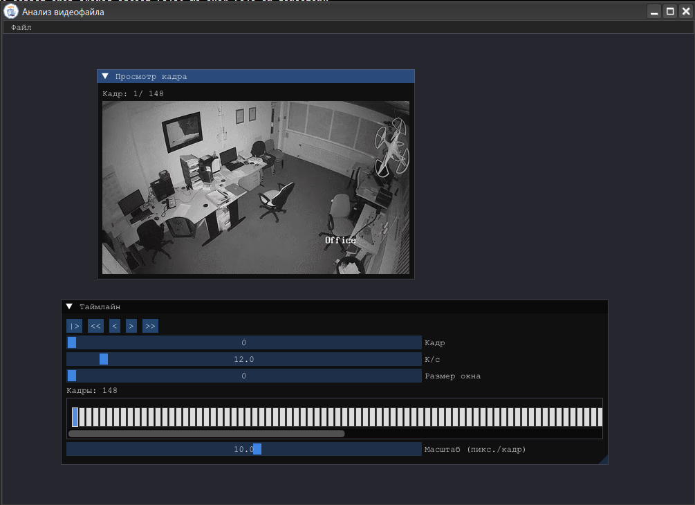

# Лабораторная работа 2

## Зависимости

- Компилятор, совместимый со стандартом C++23
- CMake
- GLEW 
- libavcodec
- SDL2

```bash
pacman -Syu gcc cmake ffmpeg glew pkgconf base-devel sdl2-compat sdl2_image sdl2_ttf
```

## Компиляция

```bash
mkdir -p build
cd build
cmake ..
make
```

## Тестирование

```bash
cd build
ctest
```




